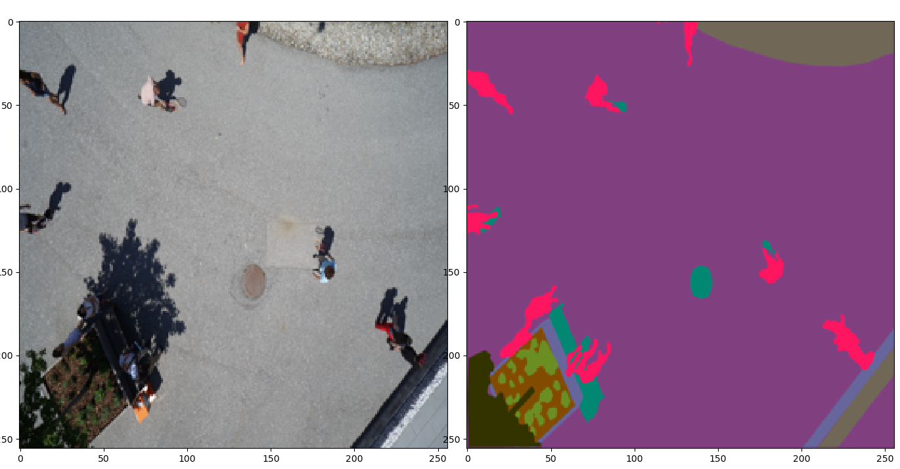
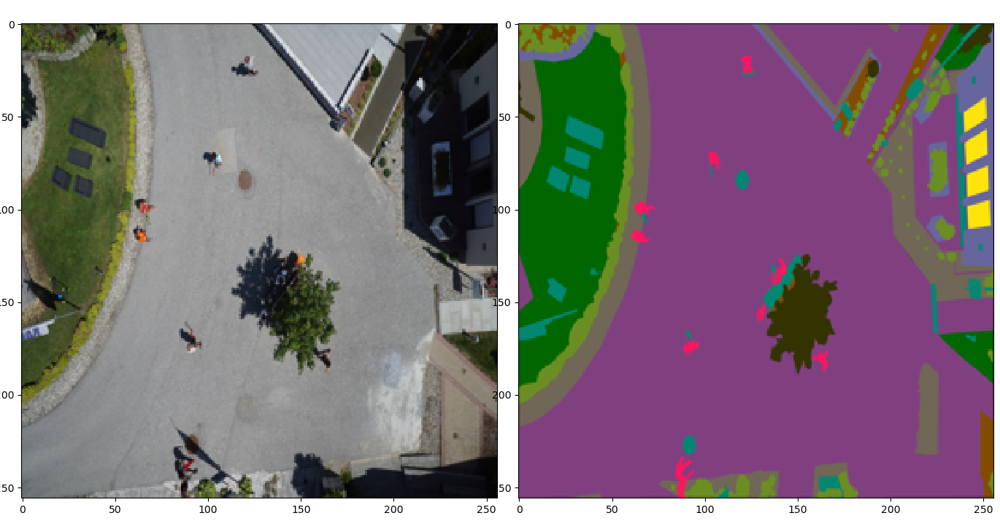
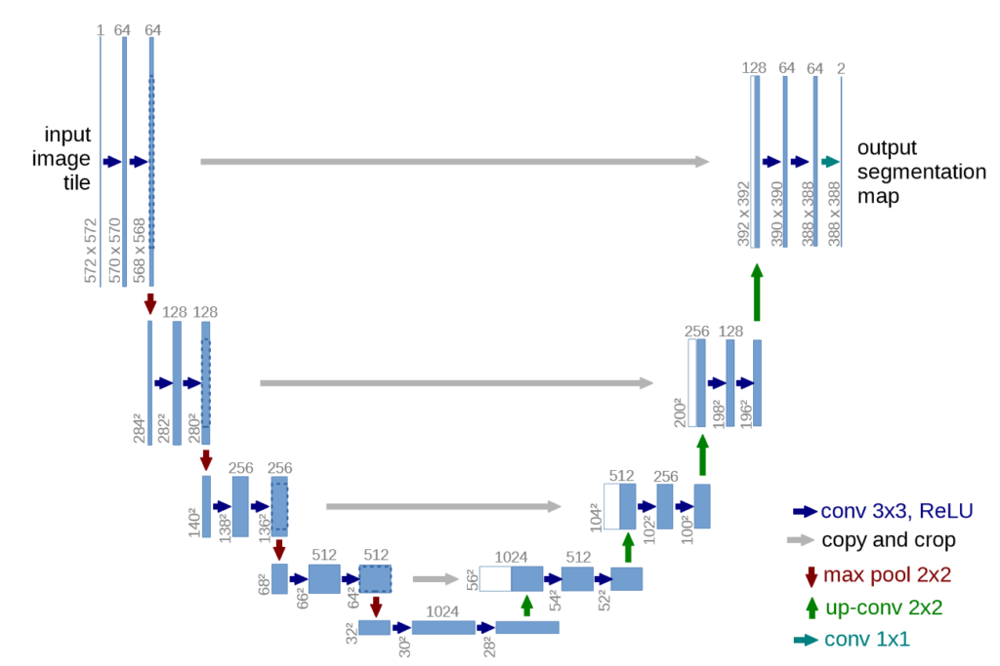
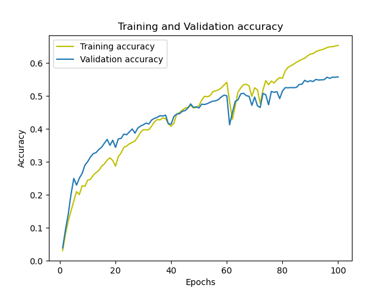
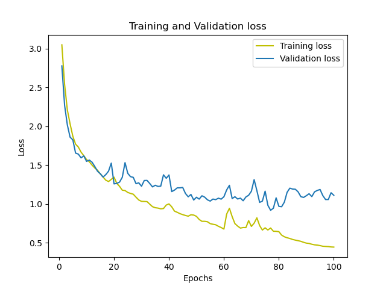

<h1>
 Unet-for-Semantic-Segmentation of Aerial Images
</h1>

In this repository I make a project on segmentation using Convolutional Neural Network architecture called U-Net
 architecture on aerial imagery dataset captured by drone.

<h3>
Content
<li style="color:#0B9170">
<ul style="color:#0B9170">
Semantic Segmentation
</ul>
</li>

<li style="color:#0B9170">

<ul style="color:#0B9170">
U-Net Architecture
</ul>
</li>
<li style="color:#0B9170">

<ul style="color:#0B9170">
Data Preprocessing
</ul>
<li style="color:#0B9170">

<ul style="color:#0B9170">
Accuracy and loss plots 
</ul>
</li>

</h3>
<h4>Semantic Segmentation</h4>
Image segmentation is the task of partitioning an image into multiple segments. This makes it a whole lot easier to analyze the given image. And essentially, isn’t that what we are always striving for in computer vision?
The below images perfectly illustrates the results of image segmentation

As seen in the figure above, detecting the objects in the content of the image with the bonding box is called  `Object detection.Semantic Segmentation`.
 # U-Net Architecture

U-Net is a specific type of CNN architecture that was bascially developed for biomedical images such as Computer Tomography(CT), MRI scans etc.

The model consist of the encoder (contraction) which is the downsampling and decoder which is up-sampling parts and it is named as U-Net because of U-shaped of the scheme as shown in figure below.

In our `Archecture.py` 
* Input is defined as 256 x 256 x 3.
* conv_1 consist of 16 filters,256 x 256 x 16 dimensions are obtained
it is reduced to 128 x128 x 16 with Maxpooling in `pool_1`.
* Similarly remaining layers architectures are shown in code.

# Data Preprocessing 
* In preprocessing first imported the `Architecture` as 
`from Architecture import multiclass_unet_architecture, jacrad,jacard_loss`
* Resized the RGB images of size 6000 x 4000 to 256 x 256 pixels.
* Rescale the RGB images using `MinMaxScaler`
* Actual image(ground truth) are imported as there was 23 labels in dataset assigned to the content 
of the images based on the pixel values.
* Label the dataset using `one-Hot-Encoded for classification
* and separate the data into training and testing.

# Accuracy and Loss plots

Accuracy metrics and Jacard index are used in the training process
`Adam` use as Oprimizer, loss is set as `categorical_crossentropy`
Below figures are `validation-jaccard` and `loss` of the training process 

